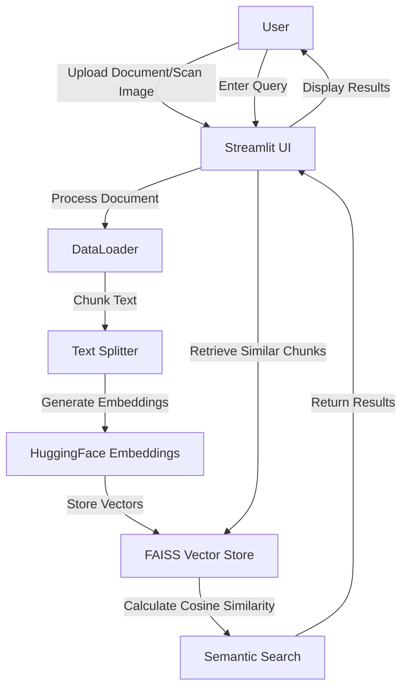

# AI-Powered Document Semantic Search without LLMs 

This project implements an AI-powered document semantic search system using Streamlit, LangChain, and various document processing techniques. It allows users to upload documents or scan images, process the content, and perform semantic searches without relying on a large language model.

## Table of Contents
- [Features](#features)
- [System Architecture](#system-architecture)
- [Setup](#setup)
- [Usage](#usage)
- [API Endpoints](#api-endpoints)
- [Contributing](#contributing)
- [License](#license)

## Features
- Document upload and processing (PDF, DOCX, TXT, XLS, XLSX)
- Image scanning and OCR for text extraction
- Text chunking and embedding using Hugging Face's sentence transformers
- FAISS vector store for efficient similarity search
- Cosine similarity-based semantic search without LLM
- Customizable chunk size and overlap
- Streamlit-based user interface for easy interaction

## System Architecture
Here's a high-level overview of the system architecture:



## Setup
1. Clone the repository:
   ```
   https://github.com/FastianAbdullah/Semantic-Search-Without-LLM.git
   ```
2. Install the required dependencies:
   ```
   pip install -r requirements.txt
   ```
## Usage:
   To start the application, run:
   ```
   streamlit run faiss_cosine.py
   ```
The application will open in your default web browser.

## API Endpoints

This project is primarily a Streamlit web application and does not expose traditional API endpoints. However, the main functionalities are accessible through the Streamlit UI:

<details>
<summary>1. Document Upload</summary>

* Upload documents (PDF, DOCX, TXT, XLS, XLSX) using the file uploader in the "Document Upload" tab.
</details>

<details>
<summary>2. Document Scanning</summary>

* Use your camera to scan documents in the "Document Scan" tab.
</details>

<details>
<summary>3. Semantic Search</summary>

* Enter your query in the search bar after processing a document or scanned image.
</details>

## Contributing

Contributions are welcome! Please feel free to submit a Pull Request.

## License

This project is licensed under the MIT License - see the [LICENSE](LICENSE) file for details.

## Acknowledgements

<details>
<summary>View Acknowledgements</summary>

* Streamlit for the web app framework
* LangChain for document processing utilities
* Hugging Face for sentence transformers
* FAISS for efficient similarity search
</details>

## Dependencies

<details>
<summary>View Dependencies</summary>

* streamlit
* langchain-text-splitters
* langchain-community
* sentence-transformers
* faiss-cpu
* pdfplumber
* pandas
* docx2txt
* numpy
* pillow
* pytesseract
</details>

## Code Overview

The main script `faiss_cosine.py` contains the following key components:

<details>
<summary>View Components</summary>

1. `DataLoader` class: Handles document loading and chunking for various file types.
2. `cosine_similarity` function: Calculates the cosine similarity between two vectors.
3. `scan_document` function: Uses OCR to extract text from scanned images.
4. `main` function: Sets up the Streamlit interface and manages the overall flow of the application.
5. `process_chunks` function: Creates embeddings, builds the FAISS index, and performs the semantic search.
</details>

## Future Improvements

<details>
<summary>View Future Improvements</summary>

* Add support for more file types
* Implement multi-language support
* Optimize performance for larger documents
* Integrate with cloud storage services for document management
</details>

Feel free to contribute to these improvements or suggest new features!
